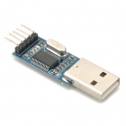

<!DOCTYPE html>
<html class="no-js" lang="en">
  <head>
  </head>
  <body>
    

      
 
        

          <h1>DFM-06 Modification to GPS-Mouse
          </h1>
          

          

          
  
          

           
          The DFM-06 is a series of small single-board Radiosonde's
          developed by Graw to carry out meteo soundings. 
          Inside houses a GPS Jupiter Telit JN3. 
          If the job is done, they are useless.. 
          But they can be recycled to GPS Mouse. 
           
          

            
Contents:

            <ul>
              <li> Overview
                <ul>
                  <li>1.1&nbsp; <a href="#Hardware_Details">Hardware
                        Details</a> </li>
                  <li>1.2&nbsp; <a href="#Needed_stuff_">Needed
                        stuff&nbsp;</a> </li>
                  <li>1.3&nbsp;<a href="#DFM-06_JN3_Modification_">
                        DFM-06 JN3 Mod.</a> 
                    </li>
                  <li>1.4&nbsp; <a
                        href="#Windows_SirfNMEA_Mode_JN3">Windows
                        Sirf/NMEA</a> 
                  </li>
                  <li>1.5<a href="#Linux_NMEASirf_">Linux
                      NMEA/Sirf mode</a><a
                      href="#Zilog_i-Met4_Decoder_Scripts"> 
                    </a></li>
                </ul>
              </li>
            </ul>
          

          <h2>Hardware Details 
          </h2>
           
          DFM-06 Details: <a href="https://www.gruan.org/instruments/radiosondes/sonde-models/graw-dfm-06/"
            target="_blank">https://www.gruan.org/instruments/radiosondes/sonde-models/graw-dfm-06/</a>
          
 &nbsp;  
            Telit JN3 Reference Design
            &nbsp;&nbsp;&nbsp;&nbsp;&nbsp;&nbsp;&nbsp;&nbsp;&nbsp;&nbsp;&nbsp;&nbsp;&nbsp;&nbsp;&nbsp;&nbsp;&nbsp;&nbsp;&nbsp;&nbsp;&nbsp;&nbsp;&nbsp;&nbsp;&nbsp;
             
          

           
          Telit Jupiter JN3 Details: <a
href="https://www.telit.com/m2m-iot-products/positioning-timing-modules/positioning-gps-jupiter-n3/"
            target="_blank">https://www.telit.com/m2m-iot-products/positioning-timing-modules/positioning-gps-jupiter-n</a> 
           
          GPS chips are often used on Radiosonde's to get a accurate
          position.  
          The JN3 uses SIRF at 9600Baud. 
           
          <h2>Needed stuff 
          </h2>
           
          DFM-06. 
          USB-TTL converter. 
          Some wires. 
          Soldering tools. 
           
          <h2>DFM-06 JN3
            Modification 
          </h2>
           
          Remove the Batteries. 
          Desolder 4 legs and remove tuner print and
          Sensor arm.
          
Wire pin 20 TX and pin 21 RX on JN3 GPS Module.

          
Wire on brown condesator above, left +3.3V and right -GND.
          

          
And solder TTL-USB converter on 4 tiny pins bottom right
            from JN3 GPS module:

          
Build together -&gt;

            
          <h2>Windows Sirf/NMEA
            Mode JN3</h2>
          
Connect with USB cable to computer.&nbsp;&nbsp;&nbsp;&nbsp;&nbsp;&nbsp;&nbsp;&nbsp;&nbsp;&nbsp;&nbsp;&nbsp;&nbsp;&nbsp;&nbsp;&nbsp;&nbsp;&nbsp;&nbsp;&nbsp;&nbsp;&nbsp;&nbsp;&nbsp;&nbsp;&nbsp;&nbsp;&nbsp;&nbsp;&nbsp;&nbsp;&nbsp;&nbsp;&nbsp;&nbsp;&nbsp;&nbsp;&nbsp;&nbsp;&nbsp;&nbsp;&nbsp;&nbsp;&nbsp;&nbsp;&nbsp;&nbsp;&nbsp;&nbsp;&nbsp;&nbsp;&nbsp;&nbsp;&nbsp;
          

          
Download and start <a
              href="https://www.falcom.de/support/software-tools/sirf/"
              target="_blank">SirfDemo </a>select COM Port (most
            probaly <a
href="http://www.prolific.com.tw/US/ShowProduct.aspx?p_id=225&amp;pcid=41"
              target="_blank">Prolific driver</a> is needed on Windows)
            and use 9600 Baud to connect. 
             
          

          
          
JN3 starts itself in Binary Sirf mode.

          
          
From action menu choose Switch to NMEA Protocol.

          
Choose a desired Baudrate.

          
          
DFM-06 works in NMEA 4800 Baud mode.

          
          
Can use any GPS Application know.

           
          
But remember to follow whole procedure again when
            disconnecting the GPS Mouse, it will start again in Binairy
            Sirf Mode..

          
A <a href="/GPS_Com1.bat?raw=true">batch file</a> can be made
            for auto startup GPS mouse in NMEA Mode .

          
Example Com:1 4800 Baud:

          
@echo off

          
echo Switching DFM to GPS mouse.

          
mode com1 baud=9600 parity=n data=8 stop=1

          
copy sirfbinary2nmea.txt com1:

          
echo&nbsp; 4800 baud.

          
 

          <h2>Linux NMEA/Sirf 
          </h2>
          
In Linux no drivers are needed to install. 
          

          
For Sifrmode on the 9600 JN3 Short Version a script can be
            made: 
          

          
<a href="/sirfbinary2nmea.txt?raw=true">sirfbinary2nmea.txt</a>

          
Make dfm.sh

          
#!/bin/sh

          
dmesg | grep ttyUSB0

          
echo "Switch DFM06 from binary 2 NMEA mode..."

          
cd /home/gps

          
sudo stty -F /dev/ttyUSB0 speed 9600

          
echo "Insert sirfbinary2nmea..."

          
cat sirfbinary2nmea.txt &gt; /dev/ttyUSB0

          
echo "Switch to 4800 Baud..."

          
sudo stty -F /dev/ttyUSB0 speed 4800

          
echo "Done DFM on 4800 Baud" 
             
          

          
 

          
Before make some sudo chown -R &lt;username:username&gt;
            /dev/ttyUSB0

          
You can use GPSD with some build in apps or use
            FoxtrotGPS/Viking. 
             
          

           
          
gpsd /dev/ttyUSB0

          
 

          
 
            NMEA Mode: 
            dmesg | grep ttyUSB

          
xgps /dev/ttyUSB0

          
cgps -s

          
gpsmon /dev/ttyUSB0

          
<a
href="https://wiki.winehq.org/index.php?title=Wine_User%27s_Guide&amp;oldid=2519#Serial_and_Parallel_Ports"
              target="_blank">Make it work in Wine</a> 
             
          

          
 

          Note:  
          
Some tutorials floating arround the net show a DFM with
            batteries connected,

          
So it can store NMEA mode in memory, for continous usage
            its not safe due the +3.3V, they can explode...

           
           
           
        

        

          
Thanks fly out to Zauberkopf.

  </body>
</html>
